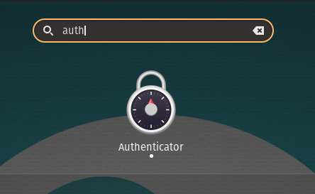
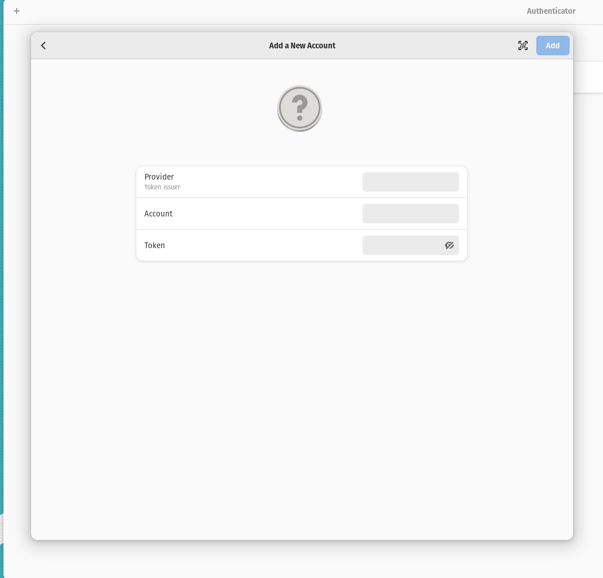
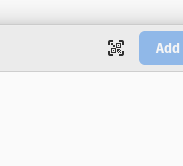
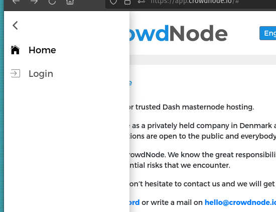
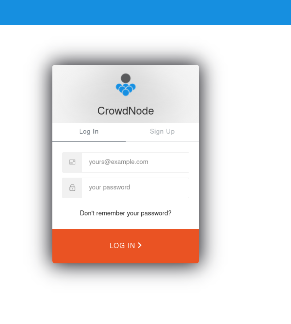

Note: These are steps for setting up on
		-- two system 76 linux machines
		-- running 20.04 pop os 
		-- without the use of a phone

you will need

		-- two emails

## Step 1 Setup Dash Core 


type in "dash core download" in google 
	and click on mobile wallet link (it has options for 
	desktop app)

OR navigate to 

https://www.dash.org/downloads/#linux


click on
-- click `download for linux`


click `Download TGZ`

open the terminal and move the zip where you want dash to live

unzip the folder

	```	
	tar -xf ./dashcore-18.1.0-x86_64-linux-gnu.tar.gz
	```

then

	```
	cd ./dashcore-18.1.0
	```
then 

	```
	./bin/dash-qt -testnet
	```

it will download the whole testnet blockchain, 
takes about an hour or two. 


## Step 2 Setup Crowdnode 

#### 1.1 -- 2fa? no phone? no problem

```
sudo apt-get install flatpak -y


flatpak install flathub com.belmoussaoui.Authenticator
```

(optional) -- if the flatpak does not exist:

```
flatpak remote-add --if-not-exists flathub https://flathub.org/repo/flathub.flatpakrepo
```

```
super 
```
then search

```
authenticator
```

you'll see lock



click on the `+` sign in the top left corner

this will show up:



*important* have the sign up page on one side of the page and the ne authenticator on the other side
if you take too long to figure out what you are doing it will error out and you 
will be unable to login or signup using that email

BUG ^^^ 

be ready to click



and then the `screenshot` button.

#### 1.2 signup

navigate to 

(because we are using test, use `app.` instead of `test.` for real endpoint)

https://test.crowdnode.io/


click on `login` in the top left corner (if you can't see it click on the top left hamburger menu)



click signup



remember you need to different email addresses, which can be 
accomplished easily if you have your own domain. I'm not sure if 
gmail works.


## Step 3 Funding CrowdNode


### 3.1 hydrate the wallet

navigate to 


