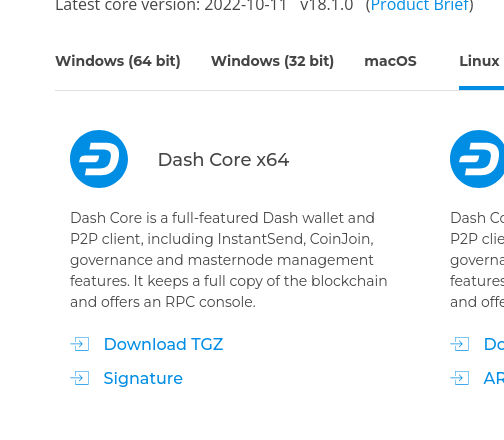

Note: These are steps for setting up on
		-- two system 76 linux machines
		-- running 20.04 pop os 
		-- without the use of a phone


## Step 1 Setup Dash Core 

type in "dash core download" in google 
	and click on mobile wallet link (it has options for 
	desktop app)

OR navigate to 

https://www.dash.org/downloads/#linux


click on
-- click `download for linux`




click `Download TGZ`

open the terminal and move the zip where you want dash to live

unzip the folder

	```	
	tar -xf ./dashcore-18.1.0-x86_64-linux-gnu.tar.gz
	```

then

	```
	cd ./dashcore-18.1.0
	```
then 

	```
	./bin/dash-qt -testnet
	```

it will download the whole testnet blockchain, 
takes about an hour or two. 


## Step 2 Setup Crowdnode 

navigate to 

because we are using test you need to use

https://test.crowdnode.io/


click on `login` in the top left corner (if you can't see it click on the top left hamburger menu)


## Step 3 Funding CrowdNode


### 3.1 hydrate the wallet

navigate to 


